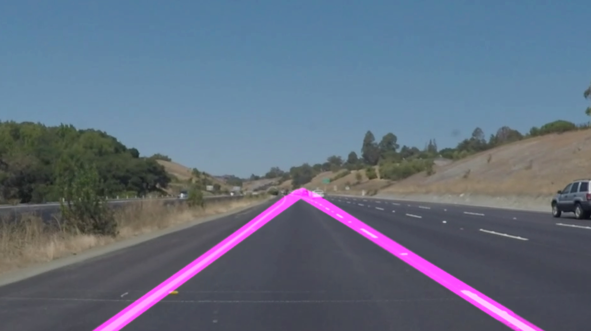

# real-time-HUD
Real time, heads up display for vehicles made with RPi 3, camera, CAN connection, and open-source technologies like OpenCV

<h2>Initial Release</h2>
The first iteration includes a real-time video processing algorithm that detects lane lines from a video recording. It includes a smoothing algorithm that takes the average of pervious frames to make for better coverage when the Hough Lines function can't detect a line.

<h2>Release 2<h2>
Adding a vehicle detection feature that works alongside the lane detection, placing retangles around moving vehicles. Removed the image smoothing by lowering the count of images that pass into the smoothing queue to 1. Increasing this will resume smoothing.

<h2>What's Next</h2>
- Working toward better algorithm performance, image smoothing requires serious compute.
- Working on including scikit features to train parameters for optimal lane detection on different types of videos.
- Building a vehicle clf for highway driving.

<h2>What to test</h2>
Test this on different videos with different parameters! Changing params in the "Main Processing Flow" block is what I'd recommend starting with. For testing different videos, just change the file that is being captured in the "Video Processing" block.
